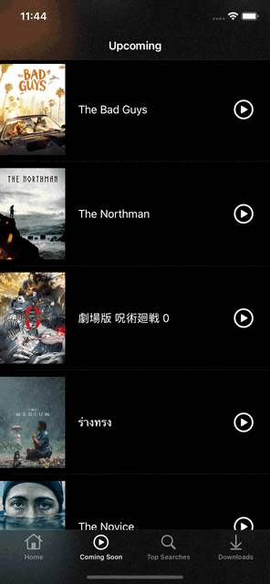

#  Установка
1. Зарегистрировать бесплатный аккаунт на [TMDB](https://www.themoviedb.org/) и получить API ключ в личном кабинете (**на данный момент в РФ работает только через VPN!**)
2. Зарегистрироваться на [Google Cloud Platform](https://console.cloud.google.com/), создать новый API ключ и активировать для него API YouTube (необходим для показа трейлеров):

3. Указать полученные ключи в файлике App.plist - ключ для TMDB указать в строчке *apiKey*, для YouTube - *youtubeApiKey*:

4. Приложение готово к запуску!

#  О приложении
Несложный клон приложения Netflix. На данный момент в РФ работает только через VPN (необходим доступ к API [TMDB](https://www.themoviedb.org/)).
Приложение отображает трендовые фильмы и сериалы на главном окне:

Показывает предстоящие релизы:

Можно посмотреть трейлер:

Можно искать по фильмотеке нужный фильм:

И добавить фильм или сериал в избранное (на вкладке Downloads).
Вёрстка реализована кодом. Стартовое окно *MainTabBarViewController*.
